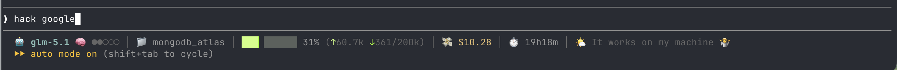

# Claude Code Status Bar

A custom, info-dense statusline for [Claude Code](https://claude.com/claude-code).



It reads the session JSON Claude Code pipes in on stdin and renders a single
colored line:

```
🤖 model  🧠 effort  ⚡fast  │  📁 folder > 🌿 branch  │  ▰▰▰▰▰▱▱▱▱ NN% (↑Nk ↓Nk/total)  │  💸 $cost  │  ⏱️ session time  │  🌅 greeting
```

## What it shows

- **Model** (cyan, bold) plus optional `🧠 effort` and `⚡ fast` badges.
- **Location** — current folder and git branch, joined by `>`.
- **Context bar** — 10 blocks × 8 sub-steps (80 levels). The filled portion
  splits into **input** (lighter shade) then **output** (darker shade); the rest
  is the lightest tint. All three derive from one hue computed from `% used`
  (green → yellow → red). Followed by `NN% (↑Nk ↓Nk/total)` — the arrows are
  tinted to match the bar (light ↑ = input, dark ↓ = output), and counts under
  1k show as a raw integer so output is always visible.
- **Spend** — session cost in USD.
- **Session time** — `MmSSs`, flipping to `HhMMm` once it passes 100 minutes.
- **Greeting** — a time-of-day emoji + a short, playful message that rotates per
  clock-hour and per day, across 6 buckets:
  `😴` late night · `🌅` dawn · `☀️` morning · `🌤️` afternoon · `🌆` evening · `🌙` night

Major groups are separated by a dim `│`.

## Install

1. Copy the script into place and make it executable:
   ```bash
   cp statusline.sh ~/.claude/statusline.sh
   chmod +x ~/.claude/statusline.sh
   ```
2. Point Claude Code at it in `~/.claude/settings.json` (see
   `settings.example.json` for a full reference):
   ```json
   {
     "statusLine": { "type": "command", "command": "~/.claude/statusline.sh" }
   }
   ```
3. Restart Claude Code (or start a new session).

Requires `jq` (and `git` for the branch segment).

## Notes

- The statusline is a **local** script — it never calls the model, so it costs
  **zero tokens**.
- Token counts are cached per session, so the context bar holds steady while a
  reply is generating instead of flickering to 0 (Claude Code omits the
  `context_window` fields mid-turn). Cache lives in `$TMPDIR/cc-statusline/`.
- Built against the **z.ai GLM proxy**; on that backend `rate_limits.*` won't
  appear and live cost may read `$0.00`. Works on plain Anthropic too.
- Some backends report a generic 200K window for unknown models, so the script
  pins known GLM sizes in a `case` block — adjust it for your own models.
- `settings.example.json` ships with the auth token **redacted** — never commit a
  real token.
